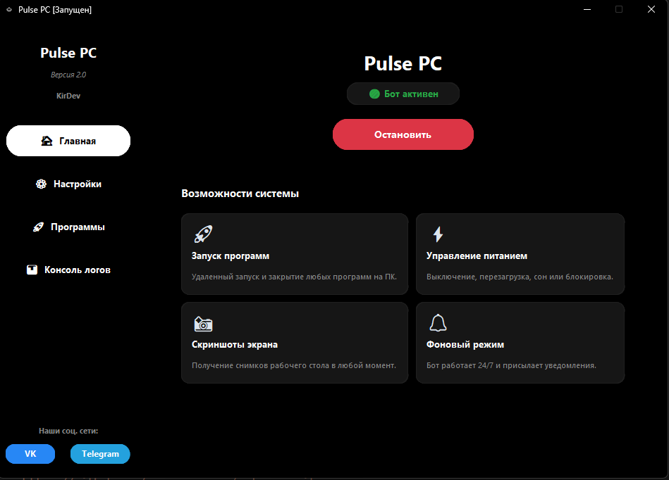
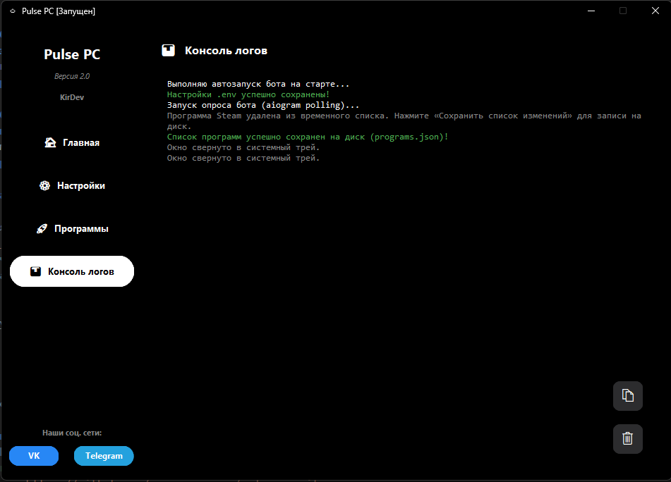
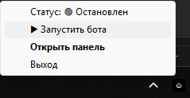

# Pulse PC (ex. Asya)

Pulse PC — это программа для удаленного управления вашим компьютером с помощью Telegram-бота. 
Программа оснащена удобным графическим интерфейсом для настройки токена и безопасным фоновым режимом работы.

## Особенности
- **Безопасность:** Полный контроль через Telegram. Уведомления о разблокировке ПК и низком заряде батареи.
- **Управление окнами:** Сворачивание, разворачивание, закрытие окон (Alt+F4), а также скриншоты экрана.
- **Работа с файлами:** Загрузка файлов на ПК и скачивание файлов с ПК.
- **Запуск программ:** Возможность настроить список быстрых команд для запуска или закрытия нужных программ. Умный поиск и принудительное закрытие зависших процессов.
- **Управление мультимедиа:** Пауза/Воспроизведение, регулировка звука и переключение треков.

## Установка

Готовая к использованию портативная сборка со встроенным установщиком доступна в архиве `Pulse_PC_Release.zip` (или в релизах GitHub, если применимо).
1. Скачайте и запустите `Pulse PC Setup.exe`.
2. Установите программу. Вы можете выбрать добавление в автозагрузку и создание ярлыка на рабочем столе.
3. При первом запуске введите ваш Telegram Bot Token (получить можно у @BotFather) и сохраните.
4. Запустите бота, нажав соответствующую кнопку.

## Для разработчиков

Проект использует `aiogram` для работы с Telegram API и `customtkinter` для современного графического интерфейса.

### Запуск из исходного кода
```bash
# Клонируйте репозиторий
git clone https://github.com/your-username/pulse-pc.git
cd pulse-pc

# Установите зависимости
pip install -r requirements.txt

# Запустите проект
cd Source_Code
python gui.py
```

## Панель управления (Графический интерфейс)
Программа обладает удобным и современным графическим интерфейсом для настройки:

* **Главная**: Панель мониторинга, где отображается статус бота. Отсюда можно быстро запустить или остановить бота. Вы также можете ознакомиться с основными возможностями (управление питанием, фоновый режим, скриншоты экрана, запуск программ).


* **Настройки**: Здесь вводится ваш `Telegram Bot Token` и `ID администратора`. Также доступна опция запуска бота вместе с Windows (в фоновом режиме).


* **Программы**: Раздел для настройки путей к приложениям. Вы можете добавить сюда программы, которые хотите запускать удаленно через Telegram.


* **Консоль логов**: Встроенный терминал для отслеживания всех событий и ошибок бота в реальном времени.


* **Системный трей**: При закрытии окна программа сворачивается в трей (рядом с часами). Через удобное меню правой кнопкой мыши можно открыть панель управления, запустить/остановить бота или выйти.


## Сборка
Проект использует PyInstaller для компиляции:
- Для сборки самого бота запустите `pyinstaller "Pulse PC.spec"` внутри папки `Source_Code`.
- Исходный код **Установщика** и **Деинсталлятора** находится в папке `Installer_Source`. Для их сборки используйте файлы `.spec` внутри этой папки.

## Лицензия
**Pulse PC** распространяется на условиях бесплатного использования.
Все права на исходный код Программы, а также на исходный код ее Установщика и Деинсталлятора (папка `Installer_Source`), принадлежат автору. 
Строго запрещено присвоение авторства, модификация исходного кода с целью создания форков/клонов и коммерческое использование. Полный текст лицензии читайте в файле `LICENSE`.
